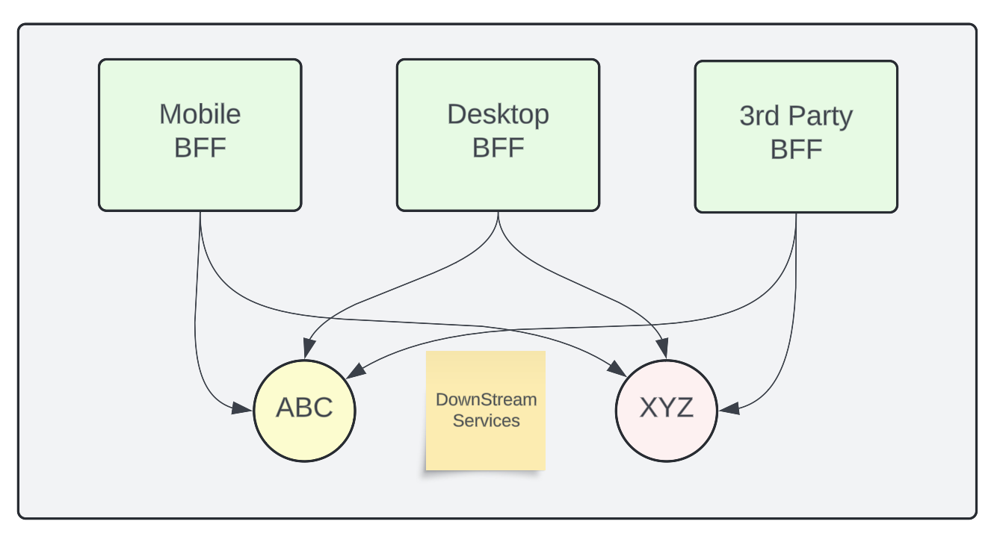
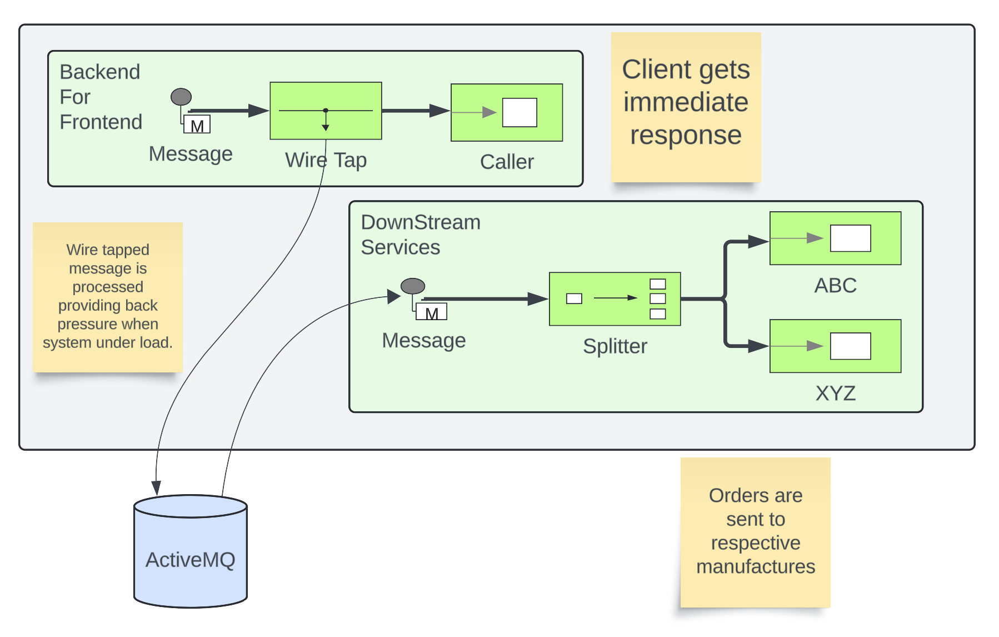

# Apache Servicemix to Apache Karaf Migration

Apache Servicemix was last released in 2017 at version 7.0.1, containing
a plethora of integration tooling including:

- Apache Camel 2.16.5

- Apache CXF 3.1.9

- Apache ActiveMQ 5.15.5

- Apache Karaf 4.0.9

As time moved on Apache Karaf has taken on the mantle of providing an
integration runtime environment. As of Apache Karaf 4.4.6, the following
tooling is provided out-of-the-box:

- Apache Camel 3.6.0

- Apache CXF 3.5.5

- Apache ActiveMQ 5.17.1

- Apache Karaf 4.4.6

Underlying these updates is the general progress of Java ecosystems from
Java 8 to Java 11 as a baseline build.

## Lets take a sample application and journey to the future!

To help illustrate our migration procedure we’ve written a small demo
application targeting Servicemix running on Java 8.

The demo application implements a portion of a Backend for Frontend
pattern.

<figure>

</figure>

This pattern is commonly used by teams to provide Restful-API support to
a variety of clients. Each BFF is connected to various down stream
services.

<figure>

</figure>

In our case, we implement two sets of routes to implement the frontend
Rest service, and supply down stream services.

The Backend for Frontend routes provides a CXF JAX-RS powered API, which
immediately replies back to the caller that an order has been received.
A wiretap sends a copy of the order for down stream processing.

The Downstream Services routes provides a splitter which can determine
which manufacture our order needs to be notified. Here we write out to a
file containing order details to each manufacture.

A common set of Models are provided to the routes to align
serialization.

The inclusion of ActiveMQ between these two sets of routes provides a
back pressure mechanism, and opportunity to scale route services
horizontally pending operational loads.

Note: ActiveMQ will need to be setup in stand-alone mode. For the
purposes of the demo, a wild card serialization exception is made in env
script.

``` bash
ACTIVEMQ_OPTS="-Dorg.apache.activemq.SERIALIZABLE_PACKAGES=*"
```

### Installing the Demo on ServiceMix 7.0.1

Now that we’ve discussed our demo application, lets take a look at it
operating on Servicemix and Karaf.

Enter the `smx` folder, and execute `mvn clean install`. This will build
the application for Servicemix.

We can install demo application 1.0.0-SNAPSHOT using the following
Servicemix console commands:

``` bash
feature:repo-add mvn:com.savoirtech.smx.app/feature/1.0.0-SNAPSHOT/xml/features

feature:install smx-original-application
```

### Installing the Demo on Karaf 4.4.6

Enter the `karaf` folder, and execute `mvn clean install`. This will
build the application for Karaf.

We can install demo application 2.0.0-SNAPSHOT using the following Karaf
console commands:

``` bash
feature:repo-add mvn:com.savoirtech.smx.app/feature/2.0.0-SNAPSHOT/xml/features

feature:install smx-original-application
```

### Testing the Demo Application

To execute the call to the restful service, be sure that you set your
client to use the POST verb and point it to:

<http://localhost:9090/rest/order/add/>

From your terminal you can try the below command:

``` bash
 curl -d "@sampleOrder.json" -X POST http://localhost:9090/rest/order/add  -H "Content-Type: application/json"
```

Your payload should look something like this (we’ve supplied
sampleOrder.json in the repo):

``` json
{
  "order": {
    "customer": {
      "lastName": "Hessla",
      "firstName": "Heaf",
      "address": "1234 Main St",
      "city": "Jackson Hole",
      "state": "WY",
      "zip": "83001"
    },
    "items": [
      {
        "product": "abc widget",
        "quantity": 2
      },
      {
        "product": "xyz widget",
        "quantity": 1
      }
    ]
  }
}
```

You should get a response such as:

``` bash
{"OrderResponse":{"status":"Thank you for your order!"}}
```

Checking your runtime container home folder, you’ll find a new directory
called "target". Within this directory you’ll find folders for "abc" and
"xyz", containing json order files.

## Iterative approach

While our demo application is small, we’ll forgo transforming it in a
single step.

### Pom Plugin Updates

Update various maven plugins.

| Plugin                 | SMX   | Karaf  |
|------------------------|-------|--------|
| maven-compiler-plugin  | 3.3   | 3.13.0 |
| maven-bundle-plugin    | 2.4.0 | 5.1.9  |
| maven-resources-plugin | 2.6   | 3.3.1  |

### Library updates

Update our project dependencies to make the container.

``` xml
<properties>
    <karaf.version>4.4.6</karaf.version>
    <cxf.version>3.5.5</cxf.version>
    <camel.version>3.6.0</camel.version>
    <activemq.version>5.17.1</activemq.version>
    <jettison.version>1.4.1</jettison.version>
    <slf4j.version>2.0.12</slf4j.version>
</properties>
```

Note: New versions of supporting libraries & frameworks exist, these are
just the base versions available.

### Adjust Code to newer libraries

#### CXF Adaptions

Updating our CXF services we encounter two issues; the namespace switch
from Javax to Jakarta, and a small change to Json Provider.

At first we need to add a few dependencies to our Model:

``` xml
<dependencies>
    <dependency>
        <groupId>jakarta.xml.bind</groupId>
        <artifactId>jakarta.xml.bind-api</artifactId>
        <version>3.0.0</version>
    </dependency>
    <dependency>
        <groupId>com.sun.xml.bind</groupId>
        <artifactId>jaxb-impl</artifactId>
        <version>3.0.0</version>
        <scope>runtime</scope>
    </dependency>
    <dependency>
        <groupId>com.fasterxml.jackson.module</groupId>
        <artifactId>jackson-module-jaxb-annotations</artifactId>
        <version>2.10.1</version>
    </dependency>
</dependencies>
```

Next, we modify uses of javax bind namespace to jakarta in the Models
module:

``` java
import jakarta.xml.bind.annotation.XmlAccessType;
import jakarta.xml.bind.annotation.XmlAccessorType;
import jakarta.xml.bind.annotation.XmlElement;
import jakarta.xml.bind.annotation.XmlRootElement;
```

Then we update the providers in our backend for frontend CXFRS wiring:

``` xml
<!-- CXF restful server endpoint -->
    <cxf:rsServer id="orderService" address="http://localhost:9090/rest"
                  serviceClass="com.savoirtech.smx.app.rest.api.OrdersResource">
        <cxf:providers>
            <!-- We switch Json Provider to Jackson -->
            <bean id="jacksonJaxbJsonProvider" class="com.fasterxml.jackson.jaxrs.json.JacksonJaxbJsonProvider"/>
        </cxf:providers>
    </cxf:rsServer>
```

We follow this up by enhancing the `Order` model with annotations to
support proper serialization:

``` java
@JsonTypeInfo(include = JsonTypeInfo.As.WRAPPER_OBJECT, use = JsonTypeInfo.Id.NAME)
@JsonTypeName(value = "order")
@JsonRootName(value = "order")
public class Order implements Serializable {

    // Adding Order getter.
    public Order getOrder() {
        return this;
    }
```

#### Camel Adaptions

Apache Camel experiences a major version update from v2 to v3.

For our demo application, this mostly affects how our `ProductSplitter`
operates. Our first change is to adapt the class to accept a Camel
`Exchange`, we then cast the Exchange In message body to our `Order`
object.

``` java
import org.apache.camel.Exchange;
import org.apache.camel.Message;
import org.apache.camel.support.DefaultMessage; //Package change on Camel 3.

import java.util.ArrayList;
import java.util.List;

public class ProductSplitter {

    // We now take Exchange from camel route and process its In Exchange.
    public List<Message> splitProducts(Exchange exchange){

        List<Message> messages = new ArrayList<Message>();

        Object body = exchange.getIn().getBody();
        Order order = (Order) body;

        for(Item item : order.getItems()){

            ProductOrder po = new ProductOrder();
            po.setCustomer(order.getCustomer());
            po.setProduct(item.getProduct());
            po.setQuanitity(item.getQuantity());

            DefaultMessage message = new DefaultMessage(exchange);
            message.setBody(po);
```

The exchange object is then used to instantiate the `DefaultMessage`
object we use to construct our return message.

A small style change is then made to our downstream route to use our
updated `ProductSplitter`:

``` xml
<bean id="splitter" class="com.savoirtech.smx.app.impl.routes.ProductSplitter"/>

    <!-- Camel configuration -->
    <camelContext id="backEnd-camelContext" trace="false" xmlns="http://camel.apache.org/schema/blueprint" >

        <!-- Split the order to manufacturers -->
        <route id="Splitter">
            <from uri="jmsConsumer:queue:orders?disableReplyTo=true"/>
            <split>
                <method ref="splitter" method="splitProducts"/>
```

## Conclusion

After applying iteratively our migration steps, our demo application is
now running on Apache Karaf 4.4.6.

For the purposes of this article, we updated the application version to
2.0.0-SNAPSHOT to help delineate the underlying runtime changes, our end
users should however not feel a change as our external API remains the
same, and our downstream services still get the files they expect.

Given the various changes underneath our application, the migration was
relatively painless, and now our users & developers get to benefit from
all the features of newer Java runtimes, Jakarta namespaces, CXF, Camel,
and ActiveMQ enhancements!

# About the Authors

[Jamie
Goodyear](https://github.com/savoirtech/blogs/blob/main/authors/JamieGoodyear.md)

# Reaching Out

Please do not hesitate to reach out with questions and comments, here on
the Blog, or through the Savoir Technologies website at
<https://www.savoirtech.com>.

# With Thanks

Thank you to the Apache Servicemix and Karaf communities.

\(c\) 2024 Savoir Technologies
